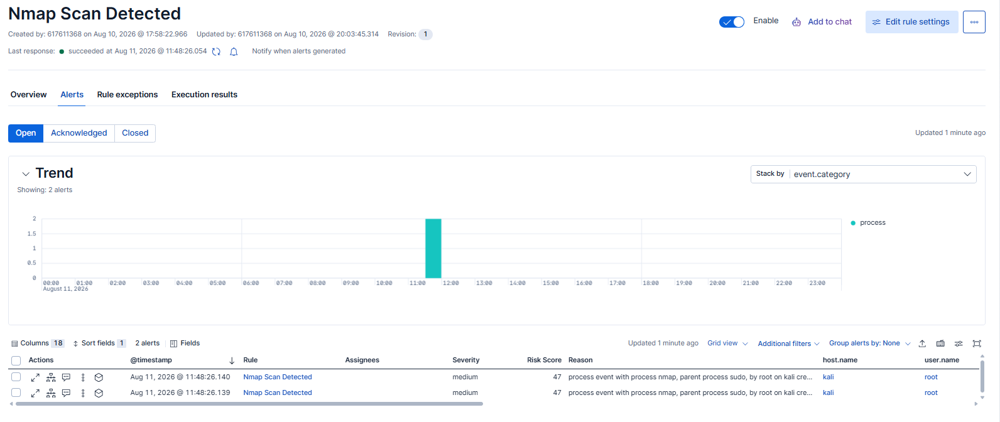
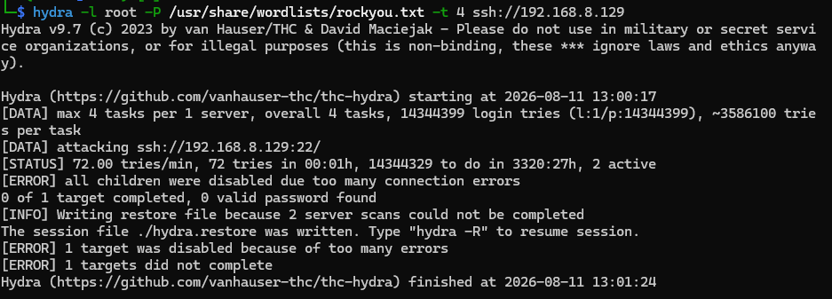
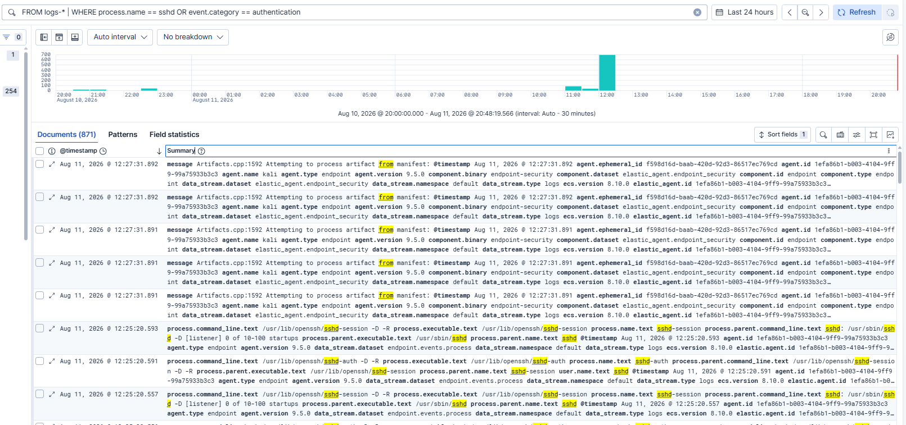
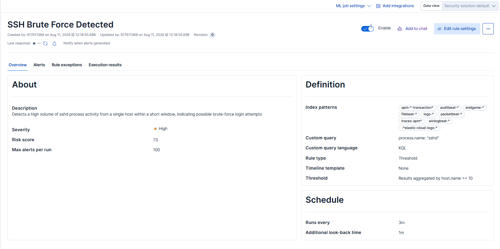
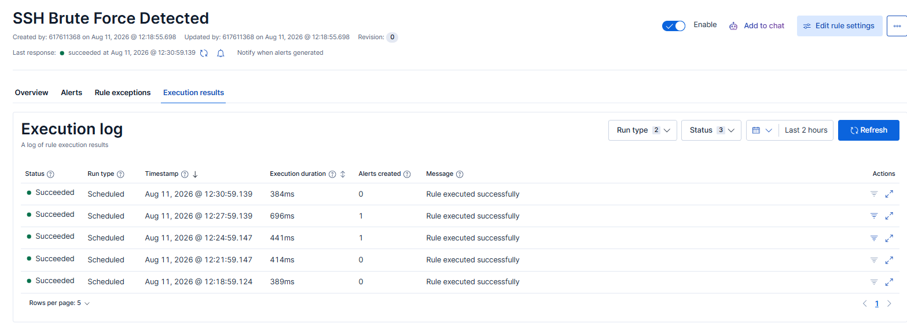

# Day 2 — Aug 11, 2026

**Goal:** Fine-tuned my detection rules; added a second attack scenario (SSH brute force) with a threshold-based rule.

## What I did
1. Tuned the "Nmap Scan Detected" rule from `process.name: "nmap"` to `process.name: "nmap" and event.category: "process"` and cut alert volume from 104 to 2 per scan by matching only the process-launch event instead of every network connection.
2. Set up an SSH brute-force scenario: enabled `sshd` on the Kali VM, installed hydra, ran a dictionary attack against Kali's own SSH service (`hydra -l root -P rockyou.txt ssh://<kali-ip>`). First run was throttled by SSH's built-in connection-error protection after ~72 attempts; ran a second burst after clearing the hydra restore file.
3. Queried Discover (ES|QL) to confirm the attack was captured and found `sshd`/`sshd-session`/`sshd-auth` process events, around 695 documents in the time window, confirming Elastic Defend tracks SSH activity as `event.category: process` rather than a dedicated authentication category.
4. Built a **Threshold rule type** that states when an "SSH Brute Force Detected" event occurs and configured to fire when the `sshd` process count is ≥10, grouped by `host.name`, within a 5-minute window (rule runs every 3 minutes with 1-minute lookback). Severity: High, risk score 73.
5. Verified the rule via its **Execution results log** rather than just checking for a single alert and confirmed it correctly stayed quiet (0 alerts) during idle periods and fired (1 alert) on the two execution windows that overlapped hydra burst, showing the non-noisy detection.

## Screenshots
#1.
  

   
   **Tuned nmap rule: 2 alerts (before/after pairing with Day 1's 104-alert cap warning)**

#2.

   
   **Hydra terminal output: attack running, then throttled ("too many connection errors")**

#3.
  

   
   **Discovered 695 sshd documents, large activity spike in histogram**

  

  
#4. 

   
   **Threshold rule Definition panel: `process.name: "sshd"`, Threshold type, "Results aggregated by host.name >= 10," severity High**

  
#5. 

   
   **Execution results log: 0/1/1/0 alert pattern across scheduled runs, proving the rule detects the burst specifically rather than firing constantly**

## Lesson learned
Elastic Defend doesn't emit a dedicated "authentication" event category for SSH — auth activity shows up as process events (`sshd-session`, `sshd-auth`). A single-event Custom query rule (like the nmap one) wasn't the right fit for brute-force detection; a **Threshold rule** — alerting on volume of `sshd` process events per host within a time window — was the correct tool, since one sshd event is normal but a burst indicates an attack. Verifying via the rule's execution history (not just a single alert) was also a better way to confirm correct tuning than eyeballing one result.
