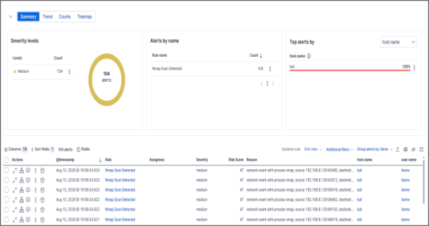
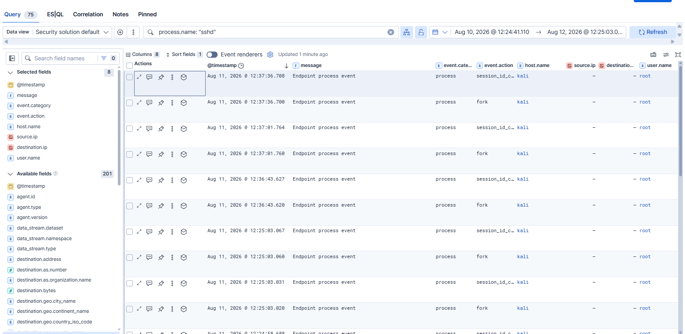

# Elastic SIEM Home Lab

Hello! This is my hands-on home lab simulating a small SOC environment. I deployed an endpoint monitoring stack with Elastic Security, then generated, detected, and investigated simulated attacks (network reconnaissance and SSH brute-force) across multiple hosts — including tuning a rule that was flooding alerts and scripting a rule export via Kibana's API.

## Architecture

```
Kali Linux VM on dedicated Proxmox server (endpoint)
   │  Elastic Agent + Elastic Defend (Complete EDR)
   ▼
Elastic Cloud — Security project
   │  Fleet (agent management)
   │  Discover (ES|QL/KQL querying)
   │  Dashboards (Lens visualizations)
   │  Detection Engine (custom + threshold rules)
   │  Timeline (correlated event investigation)
   ▼
Alerts (triaged, attributed to host/user/process)
```

## Highlights
 
- **Deployed and monitored two endpoints** (Kali + Ubuntu) with Elastic Agent / Elastic Defend, confirmed healthy in Fleet.
- **Built and tuned a custom detection rule** — an initial nmap-scan rule flooded 104 alerts from a single scan; refined it to fire 2, by matching on the specific event instead of every network connection.
  
  *104 alerts hitting Kibana's per-execution cap — the problem that drove the tuning work below.*
- **Wrote a threshold-based rule** for SSH brute-force detection (`sshd` process count ≥10/host in 5 min), since a single occurrence is normal but a burst isn't.
- **Investigated a fired alert with Timeline**, correlating 75 related events into a readable process narrative — moving past "a rule fired" to "here's what actually happened."
  
  *Process lineage behind the SSH brute-force alert, rendered as a readable narrative rather than raw JSON.*

  
- **Confirmed detection logic generalizes** — enrolled a second host and the existing nmap rule fired correctly with zero changes.
- **Scripted rule export via Kibana's Detection Engine API** (Python), instead of relying on manual UI export.
  
## What this demonstrates
 
**- Endpoint deployment**  
**- Detection rule authoring and tuning**  
**- Alert triage/investigation**  
**- Multi-host operations**   
**- Working with the platform programmatically, not just through the UI**  

## Lessons learned

- **Project type matters.** A plain "Elasticsearch" Elastic Cloud project has no Security app (no Alerts, Detection rules, Cases) — only a "Security" project type includes it.
- **Rule query granularity drives alert volume.** Matching on every related event (e.g. one alert per network connection in a port scan) causes alert fatigue; matching on the more meaningful event (e.g. process launch) keeps signal high and noise low.
- **Not every telemetry source has a dedicated event category.** Elastic Defend surfaces SSH activity as `event.category: process`, not a dedicated "authentication" category; it is worth checking the actual field values in Discover before assuming a category exists.
- **Different rule types fit different signals.** A single occurrence of `nmap` running is inherently suspicious (Custom query rule fits). A single `sshd` process is normal, and only a *burst* is suspicious (Threshold rule fits). Picking the right rule type is crucial for the detection design.
- **Detection and investigation are different skills.** A rule firing tells you *something* happened; Timeline's correlated view and readable event narratives are what actually explain *what* happened — closer to real SOC triage rather than reading an alert summary line.

## Day-by-day journal

- [Day 1](Journal-/Day-1.md) — Initial lab setup, agent enrollment, first detection rule
- [Day 2](Journal-/Day-2.md) — Rule tuning, SSH brute-force scenario, threshold rule
- [Day 3](Journal-/Day-3.md) — Alert investigation using Timeline
- [Day 4](Journa-l/Day-4.md) — Second Host Enrollment (Ubuntu) 
- [Day 5](Journal-/Day-5.md) — Scripted rule export via API
  
## Rule definitions (exported)

Exported detection rule configurations are in [`/rules`](rules):
- [`detection-rules-export-formatted.json`](rules/detection-rules-export-formatted.json) — readable, indented version
- [`detection-rules-export.ndjson`](rules/detection-rules-export.ndjson) — original raw export

Exported via **Detection Rules page → select rules → Bulk actions → Export** (note: the generic Stack Management → Saved Objects → Export path does *not* work for detection rules — they're excluded from that export by design).

## Rule definitions (exported)

See `/rules` for exported JSON of each detection rule (Stack Management → Saved Objects → Export).
